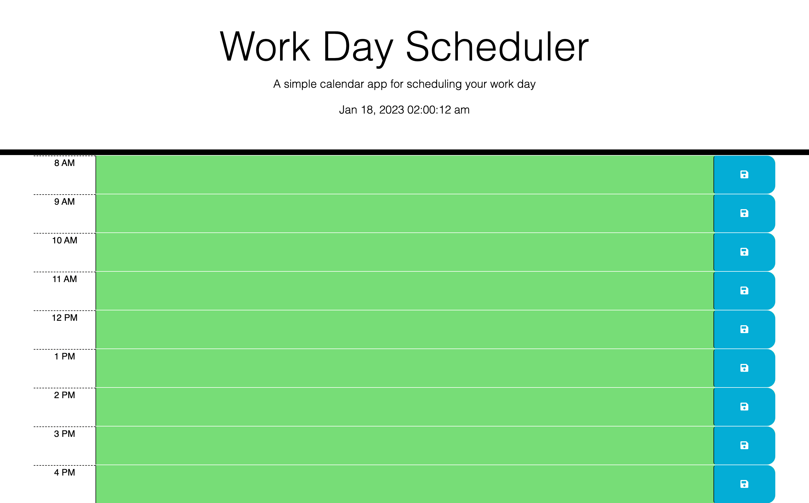

# DailyPlanner
- Here I have a daily planner that allows you to input input and save whatever you wish to add to it locally
- The HTML and CSS sheets were supplied to me, I made minor adjustments to them
- What I learned while doing this project is how to link a Third Part Api, parse through the data, set classes based off of that data, then save whatever the user inputs locally if they desire

## Usage 
- First things first, deploy the webpage from here https://jonathanguhl.github.io/DailyPlanner/
- The Browser should look like this upon loading 
    
- Heres an example given to me of a user interacting with a very similar browser 
    
- Depending on the time of the day, the blocks will be displayed in different colors to help show if the hour has passed. Past hours will be displayed in grey. The current hour will be displayed in red. Future hours will be displayed in green.
- From there you can input whatever you'd like in each block and then click the save button (floppy disk image) to save whatever you've typed
- Refresh the page and whatever you've saved should still be there for you